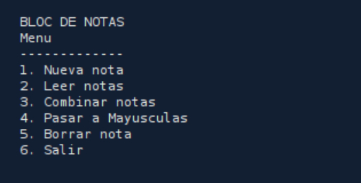
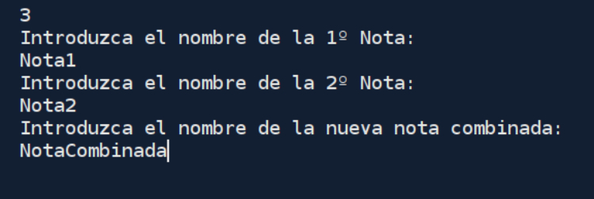
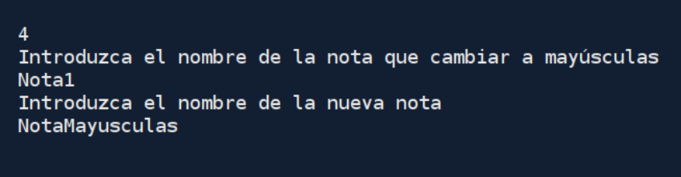

# Bloc de Notas

**Programa para crear notas de texto desde consola**, en el podrás crear nuevas notas, leerlas, combinarlas, cambiar el texto a mayuscula y eliminarlas.

# Menú 

Este es el menu principal, cada opción esta numerada, debiendo introducir dicho número para acceder a la opción deseada.

# Funcionamiento 
En todas las opciones el usuario deberá introducir el nombre de la nota que desea crear, leer, combinar, pasar a mayusculas o eliminar. No es necesario introducir .txt solo el nombre de la nota.

Para la opción de combinar notas, deberá introducir los nombres de las dos notas a combinar y el nuevo nombre para la nueva nota combinada.

Para la opción de pasar a mayúsculas también es necesario introducir un nuevo nombre para la nota nueva con el texto en mayúsculas.

